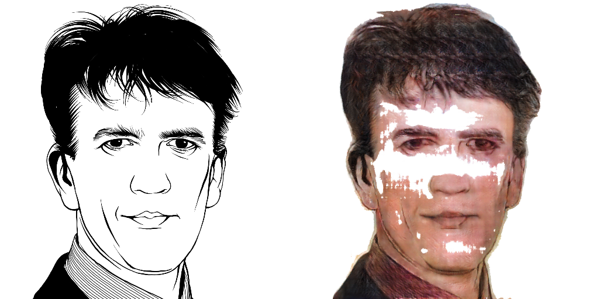
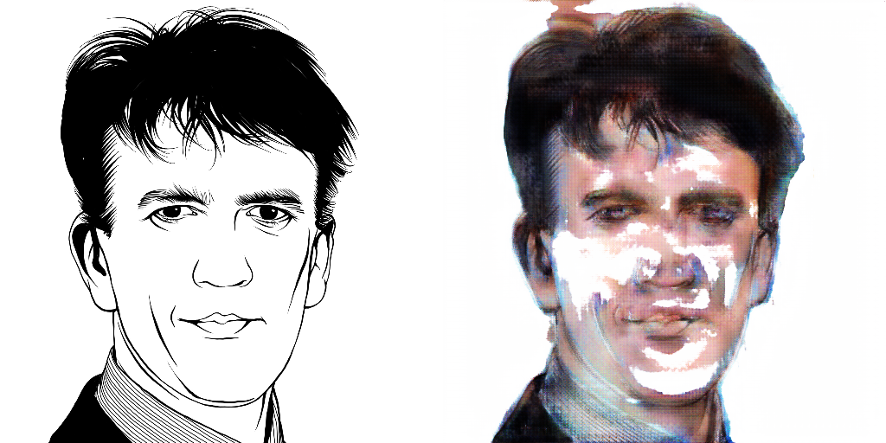
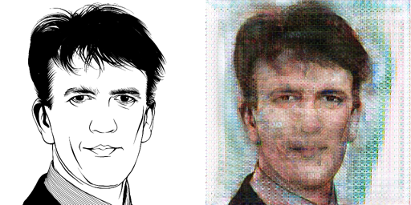
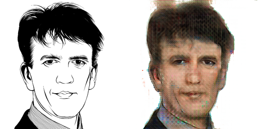

# RESULTS

# Table Of Contents
- [RESULTS](#results)
- [Table Of Contents](#table-of-contents)
  - [Visual results](#visual-results)
  - [Samples with different architectures](#samples-with-different-architectures)
  - [Losses](#losses)
  - [Training method](#training-method)

## Visual results

1. The generator was able to generate rather realistic images however they were incomplete. They looked similar to incomplete paintings.
2. Despite not having colour information, the generator was able to generate images with similar colours to the original images.
  - This could mean that the generator was able to learn the colour information from the features
3. The model was generating similar images but with unnecessary noise
   - More experimentation needs to be carried out -> moved into TODO

Here are some of the samples, as mentioned, more experimentation needs to be carried out to improve the results.

## Samples with different architectures

> Initial run with the original pix2pix architecture

> Run with VGG generator, default discriminator and perceptual loss

> Run with VGG generator, VGG discriminator and perceptual loss, without mask

> Final run with VGG generator, VGG discriminator and perceptual loss, with mask

## Losses

__Perceptual loss:__

The VGG features are from the first 3 conv outputs before the max pool layers.

Thereafter, the mean squared error is calculated between the features of the original image and the generated image.

The perceptual loss was given a weight of 0.5 and the lambda value for the l1 loss function was set to 100.

## Training method

Several methods were used to train the model:
- Changing beta values
- Increasing learning rate of discriminator instead of decreasing generator
- Different run counts and batch sizes

The final method used was:
1. The model was trained for 5 runs with 100 epochs with a batch size of 1 for image sizes 512x512. This was with the generator vgg layers frozen to allow the other layers to learn first.
2. After the losses have stabilised, the vgg layers were unfrozen and the model was trained for another 10 runs with 100 epochs.
3. An EarlyStopping callback was set on the discriminator loss to prevent the generator from overpowering the discriminator.
4. After the model encounters an early stop, the learning rate of the generator is reduced by 50%. This is allowed to happen for 10 times. 