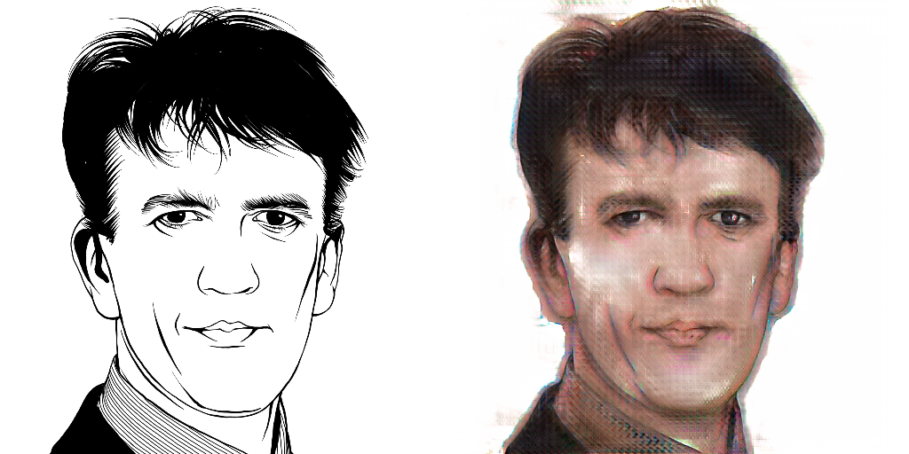

# RESULTS

# Table Of Contents
- [RESULTS](#results)
- [Table Of Contents](#table-of-contents)
- [Visual results](#visual-results)
- [Samples with different architectures](#samples-with-different-architectures)
- [Losses](#losses)
- [Training method](#training-method)
- [Training times](#training-times)
- [Training notes](#training-notes)

# Visual results

Generator and discriminator from pix2pix
1. The base generator was able to generate rather realistic images however they were incomplete. They looked similar to incomplete paintings.
2. Despite not having colour information, the generator was able to generate images with similar colours to the original images.
  - This could mean that the generator was able to learn the colour information from the features
3. The model was generating similar images but with unnecessary noise
   - More experimentation needs to be carried out -> moved into TODO

VGG generator and discriminator
1. The VGG pretrained model was able to generate fully images, however all the colours were the same. Placing a higher weight on L1 loss may help. 
2. Increasing the image size to 512x512 introduced more white spaces, similar to the first run. 

# Samples with different architectures

Here are some of the samples, as mentioned, more experimentation needs to be carried out to improve the results.

> Initial run with the original pix2pix architecture

> Run with VGG generator, default discriminator and perceptual loss

> Run with VGG generator, VGG discriminator and perceptual loss, without mask

> Final run with VGG generator, VGG discriminator and perceptual loss, with mask

> VGG Generator, VGG Discriminator, Perceptual loss, Mask, 512x512, Generator learning rate multiplied by 0.5 after early stop

> VGG Generator, VGG Discriminator, Perceptual loss, Mask, 512x512, Discriminator learning rate multiplied by 1.1 after early stop

# Losses

__Perceptual loss:__

The VGG features are from the first 3 conv outputs before the max pool layers.

Thereafter, the mean squared error is calculated between the features of the original image and the generated image.

The perceptual loss was given a weight of 0.5 and the lambda value for the l1 loss function was set to 100.

# Training method

Several methods were used to train the model:
- Changing beta values
- Increasing learning rate of discriminator instead of decreasing generator
- Different run counts and batch sizes

The final method used was:
1. The model was trained for 5 runs with 100 epochs with a batch size of 1 for image sizes 512*512 and batch size of 4 for 256*256. This was with the generator VGG layers frozen to allow the other layers to learn first.
2. After the losses have stabilised, the VGG layers were unfrozen and the model was trained for another 10 runs with 100 epochs.
3. An EarlyStopping callback was set on the discriminator loss to prevent the generator from overpowering the discriminator.
4. After the model encounters an early stop, the learning rate of the generator is reduced by 50%. This is allowed to happen for 10 times. 

# Training times

A spot instance was used to reduce cost, at the expense of possible termination. The instance was terminated 3 times during training, however the model was able to recover from the weights saved in the checkpoints. 

The cloud GPU used was a single RTX 4090. Training times for 512x512 images was approximately 2 hours. The first hour was to allow the layers after the VGG layers to learn first. Thereafter, the VGG layers were unfrozen and the model was trained for another hour. 

# Training notes

- Further optimisation can be done to reduce training time, such as using a larger batch size. However it was recommended in the pix2pix paper to use a batch size of 1.
- Better monitoring of training metrics should be utilised to reduce unnecessary training time. This is to determine the point of diminishing returns.
- Understand the architecture of the generator and discriminator better to improve the model.

Generative - Having the power or function of generating, originating, producing, or reproducing.
Adversarial (Adversary) - One that contends with, opposes, or resists: an enemy or opponent.
Net (Network) - a computer architecture in which a number of processors are interconnected in a manner suggestive of the connections between neurons in a human brain and which is able to learn by a process of trial and error.

In summary, 